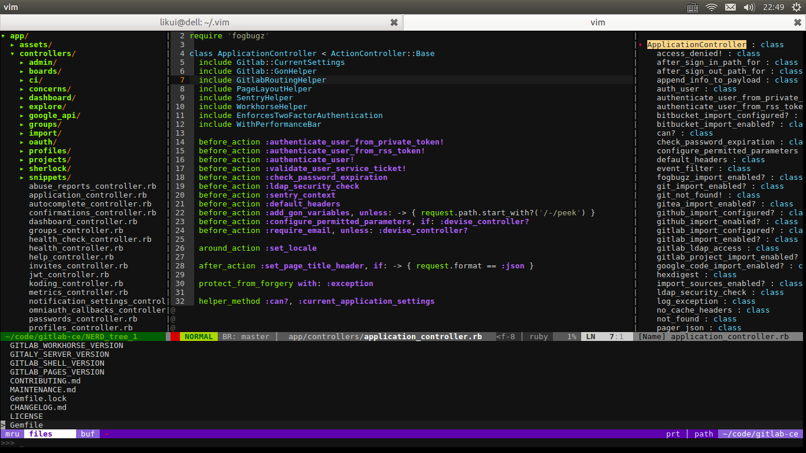

# Vim Config

## Install

Home 目录下：

```sh
git clone https://github.com/lowkey2046/vim-rc.git .vim
ln -s .vim/vimrc .vimrc
cd .vim
git submodule init
git submodule update
```

启动 vim 命令模式输入

```
:BundleInstall
```

## Usage

* F2 行号, 粘贴
* F3 左侧 NERD Tree
* F4 右侧 Tagbar
* Ctrl+P 搜索


